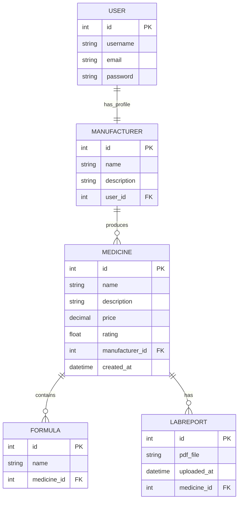

## ERD Explanation

The system consists of five main entities:

- **User** – Handles authentication
- **Manufacturer** – Linked to a user profile
- **Medicine** – Core product entity
- **Formula** – Chemical composition linked to medicine
- **LabReport** – Uploaded verification documents

### Relationships

- One **User** → One **Manufacturer**
- One **Manufacturer** → Many **Medicines**
- One **Medicine** → Many **Formulas**
- One **Medicine** → Many **LabReports**

The schema follows normalization principles to avoid redundancy and improve scalability.

---

## User Roles

### Standard User

- Browse medicines
- Search and filter
- View details
- Make purchases

### Manufacturer

- Submit new medicines
- Upload lab reports
- Manage product listings

---

## Core Features

- CRUD operations for medicines
- Search by name and formula
- Filtering and sorting by price/rating
- File upload (PDF lab reports)
- Stripe checkout integration
- Role-based access control
- Responsive UI

---

## Planned Updates

- AI-based medicine recommendation
- Notifications for new medicines or price drops
- Analytics dashboard for manufacturers
- Multi-language support
- Improved lab report verification system
