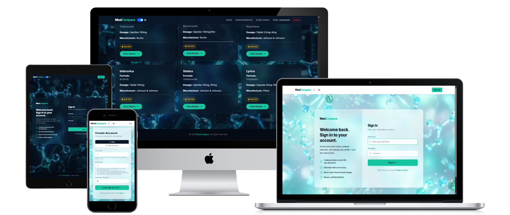

<h1 align="center">💊 Comparative Medicine Database</h1>

<p align="center">
  
</p>

<p align="center">
  <em>A full-stack web application for searchable, comparable, and verified medicine information</em>
</p>


<p align="center">
  
  
  
  
  
  
</p>

<p align="center">
  <a href="https://mz-medcompare-app-9e3f302ecb1b.herokuapp.com/accounts/login/">Live Demo</a>
</p>

---

## Table of Contents
- [Purpose](#purpose)
- [Features](#features)
- [Tech Stack](#tech-stack)
- [Target Users](#target-users)
- [Scalability & Maintenance](#scalability--maintenance)
- [Deployment](#deployment)
- [ERD Diagram](ERD.md#erd-diagram)
- [ERD Explanation](ERD.md#erd-explanation)
- [User Roles](ERD.md#user-roles)
- [Core Features](ERD.md#core-features)
- [Planned Updates](ERD.md#planned-updates)
- [Contact](#contact)
- [Screenshots](#screenshots)
- [AI Declaration](#ai-declaration)
- [License](#license)

---

## Purpose

<p align="center">This project solves challenges in navigating the pharmaceutical market. Users face difficulties retrieving accurate medicine information, comparing similar products, and verifying quality reports. The Comparative Medicine Database provides a centralised, user-friendly platform where consumers, healthcare professionals, and manufacturers can search, compare, and manage medicine data securely.</p>

---

## Features

- **Advanced Medicine Search**: Search by brand name, generic name, or active ingredient  
- **Formula-Based Comparison**: Compare all medicines containing the same formula  
- **Dynamic Filtering & Sorting**: Filter by quality ratings, sort by price  
- **Lab Report Upload & Viewing**: View PDF lab reports for quality verification  
- **Manufacturer Portal**: Secure registration, medicine submission, document upload  
- **Payment Integration (Stripe)**: Secure one-time purchases and subscription payments  
- **Responsive Design**: Optimised for desktop, tablet, and mobile  

---

## Tech Stack

- **Backend:** Django (Python)  
- **Frontend:** HTML, CSS, Bootstrap, JavaScript  
- **Database:** PostgreSQL  
- **Payment Integration:** Stripe  
- **Deployment:** Heroku  
- **Authentication:** Django Authentication System  

---

## Target Users

- Consumers seeking verified and affordable medicine options  
- Healthcare professionals looking for comparative data  
- Pharmaceutical manufacturers managing product listings  
- Charity organisations promoting transparency  

---

## Scalability & Maintenance

- **Database Scalability:** PostgreSQL handles growing records and users efficiently  
- **Modular Architecture:** Easily add new features like analytics or AI recommendations  
- **File & Media Management:** Cloud storage for lab reports and documentation  
- **User & Role Expansion:** Add new roles like auditors or pharmacists without breaking the system  
- **Maintainability:** Well-structured code and clear documentation for easy future updates  

---

## Deployment

```bash
git clone https://github.com/muazainal/mz-medcompare.git
cd mz-medcompare
python3 -m venv .venv
source .venv/bin/activate   # Linux / Mac
.venv\Scripts\activate      # Windows
pip install -r requirements.txt
python manage.py migrate
python manage.py runserver
```
---

## Contact

- **Developer:** Muaz Zainal
- **Email:** muazainal@live.com
- **GitHub:** [mz-medcompare](https://github.com/muazainal/mz-medcompare)

---

## Screenshots

You can find more screenshots of the application, including light and dark mode versions, in the [Screenshots](Screenshots/) folder.

---

## AI Declaration

<p align="center">I acknowledge the use of Artificial Intelligence (AI) tools as an assistive resource during the development of this project. AI was used to support activities such as code generation, debugging, concept explanation, and architectural planning.</p>

<p align="center">All AI-generated outputs were critically reviewed, tested, and modified where necessary. The final implementation, design decisions, integration, and validation of the system were completed by me. AI was used solely as a productivity aid and did not replace my own understanding or responsibility for the work submitted.</p>  

---

## License

This project is licensed under the [MIT License](LICENSE).


