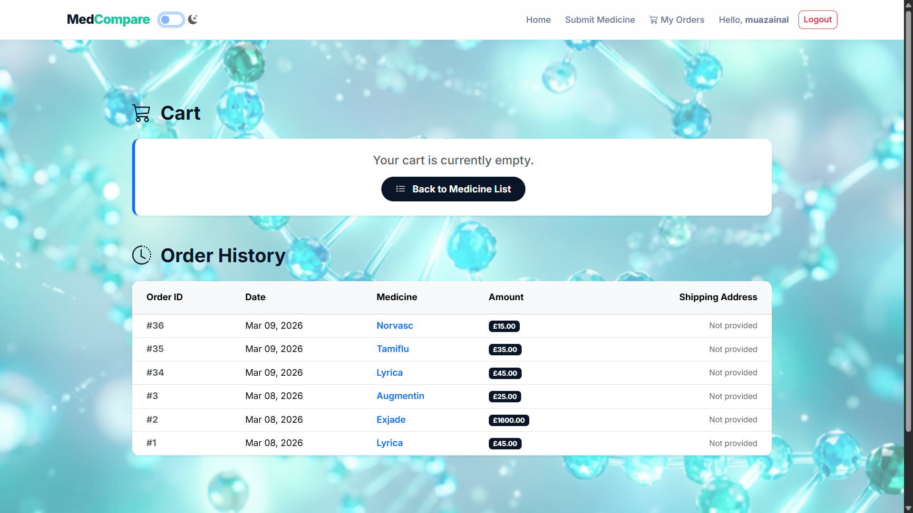

# Application Screenshots

This document showcases the various interfaces and themes of the Comparative Medicine Database application, using actual screenshots from the live system.

---

## Web Interface - Light Mode
The light theme emphasizes clarity and a professional medical aesthetic.

### Landing / Medicine List

  

### Authentication (Login & Signup)

  
  

### Management & Cart

  
  

---

## Web Interface - Dark Mode
A contrast-optimized dark theme designed for accessibility and reduced eye strain.

### Medicine List

  

### Authentication & Management

  
  

### Cart View

  

---

## Responsive Design Overview

  

---

## Performance & Design
For detailed performance metrics and our design palette, please see the **[Performance & Design Document](DESIGN_PERFORMANCE.md)**.
